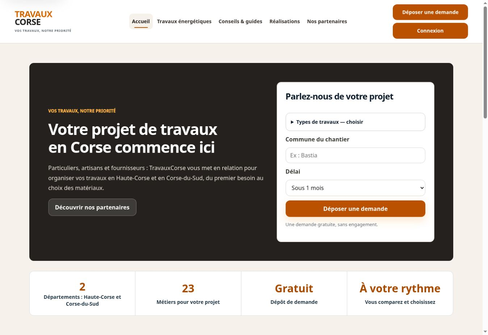

# Audit TravauxCorse — septembre 2026

## Version publiée

Travail appliqué directement au dépôt `unitiinseme-maker/travauxcorse.com` et déployé par Vercel. Version applicative : `07eecdcfb72b776165f51901adc3c48392db007b`.

## Corrections

- Header et footer communs, navigation visible dès 768 px, menu mobile accessible et fermeture par Échap. Header sur une ligne dès 1200 px ; deux lignes sur les formats intermédiaires.
- Identité beige, noir, orange et blanc ; orange assombri sur les boutons pour améliorer le contraste du texte blanc. Espacements, cartes, formulaires et tailles de titres harmonisés. Footer conforme à la référence demandée.
- Suppression des statistiques commerciales non justifiées. Clarification du parcours particulier → TravauxCorse → artisan → fournisseur. Deux accès principaux au dépôt sur l’accueil, métiers regroupés dans une liste repliable.
- 23 métiers, cases à cocher multiples, conservation des anciennes sélections et des catégories personnalisées.
- Dépôt : libellés associés, validation des coordonnées et champs, erreurs accessibles, récapitulatif, contrôle des fichiers et envoi multipart. Candidature partenaire reliée au service d’envoi au lieu d’une fausse inscription locale.
- Réalisations : gabarit de cartes et galerie adaptés, images à chargement différé, filtres issus des catégories réellement publiées, protection contre les contenus HTML injectés. Aucun chantier ou témoignage inventé.
- Administration discrète depuis Connexion ; outils historiques conservés. Chargement du portail uniquement à la demande. Correction des fausses confirmations de réinitialisation et séparation du stockage public / de session ; sauvegardes du site limitées aux contenus publics.
- Pages HTML pré-rendues pour l’accueil, l’énergie, les partenaires, la demande et la candidature ; URL dédiées, anciennes routes conservées, sitemap, métadonnées de partage, favicon et visuel social. Suppression des polices tierces et de fonctions anciennes non appelées.
- En-têtes de sécurité, restriction des scripts et des formulaires, protection contre l’encadrement des pages administrateur ; contrôles d’origine, CSRF, sessions signées et brouillons chiffrés maintenus. Traitement des requêtes JSON invalides et limitation des tentatives de connexion renforcés.

## Vérifications

- Matrice finale : **18 parcours × 9 largeurs = 162 contrôles réussis**, sans débordement relevé et avec les menus attendus. Détails dans `responsive-results.json`. Administration protégée vérifiée séparément sur ordinateur ; ses onglets sont couverts par les tests de rendu.

- `node --test tests/*.test.cjs` : 14 tests réussis, dont rendu de tous les onglets des quatre profils de démonstration, validation des fichiers, routes, catégories, échappement HTML, authentification du CMS, publication, retrait, suppression et conflits simulés.
- `python scripts/check.py` : 17 pages HTML, un H1 et une URL canonique par page, aucun lien interne de ressource manquant détecté.
- `node --check` : tous les fichiers JavaScript et CommonJS passent.
- Parcours navigateur : demande sans sélection refusée, deux métiers conservés, PDF fictif attaché et conservé jusqu’au récapitulatif, navigation et chargement différé des espaces vérifiés. Aucun email de test envoyé.
- Pas d’erreur applicative importante relevée dans la console sur les parcours vérifiés. Les messages propres à l’extension de contrôle du navigateur sont exclus.
- Les tests de largeur mesurent le rendu Chromium dans des fenêtres incorporées. Ils contrôlent débordements, navigation mobile/ordinateur et unicité du H1. Ils ne constituent pas une certification sur tous les appareils ou navigateurs.

## Dépendances externes et limites restantes

1. **CMS de publication : activation nécessaire.** Configurer `CMS_GITHUB_TOKEN`, `CMS_ADMIN_PASSWORD` et `CMS_SECRET` dans Vercel, puis redéployer. Instructions dans `README.md`. Aucun secret ne doit être placé dans les fichiers publics ou transmis dans le chat.
2. **Espaces clients/artisans/fournisseurs et édition générale : encore locaux.** Ils ne sont pas reliés à un service d’authentification, une base de dossiers ou un stockage privé partagé. Ils ne doivent pas être présentés comme un portail métier opérationnel. L’édition générale historique ne modifie que le navigateur utilisé ; elle ne publie pas le site pour les autres visiteurs.
3. **Réception des demandes : à confirmer par l’exploitant.** L’adresse destinataire doit être activée chez FormSubmit et un essai réel reçu dans la messagerie doit être confirmé. Le contrôle du formulaire ne prouve pas la livraison d’un email. Les contrôles de fichiers côté navigateur ne remplacent pas un antivirus côté prestataire.
4. **Contenus réels : à fournir.** Partenaires confirmés, chantiers et photographies autorisées doivent remplacer les exemples et remplir la page Réalisations. Les filtres sont préparés dans le gabarit et testés avec des données synthétiques ; aucun contenu fictif n’est publié comme réalisation réelle.
5. **Domaine et compatibilité.** La version Vercel est vérifiée. La configuration du domaine personnalisé `travauxcorse.com`, sa redirection canonique et des essais sur appareils Safari/Firefox réels restent à confirmer. Les ressources éditoriales externes peuvent évoluer. Deux anciennes URL AUE ont été remplacées par les pages officielles actuelles ; les liens France Rénov’ n’ont pas pu être confirmés depuis l’outil de consultation (erreurs 502), sans preuve qu’ils soient indisponibles pour les visiteurs.

Ces limites empêchent de certifier une plateforme métier entièrement prête pour la production, même si les corrections du site public ont été déployées.

## Fichiers principaux

`app.js`, `portal.js`, `styles.css`, `navigation.js`, `admin/editor.js`, `api/editorial.js`, `lib/content-render.js`, `lib/content-layout.json`, les 17 pages HTML, `scripts/build.cjs`, `scripts/check.py`, `tests/*.test.cjs`, `vercel.json`, `sitemap.xml`, `robots.txt`, `favicon.svg`, `social-card.png` et `README.md`.

